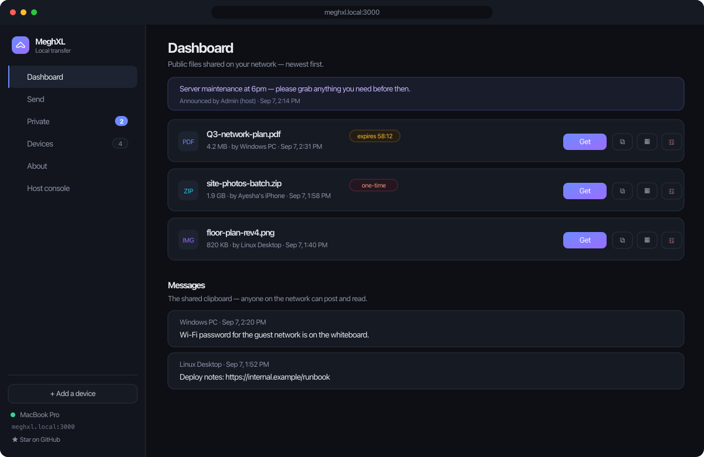
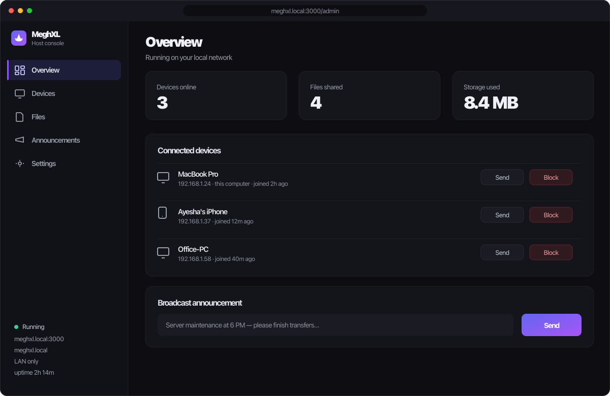

<p align="center">
  
</p>

<p align="center">
  <a href="https://github.com/riponcm/MeghXL/releases"></a>
  <a href="https://github.com/riponcm/MeghXL/releases/latest"></a>
  <a href="https://github.com/riponcm/MeghXL/actions/workflows/ci.yml"></a>
  <a href="./LICENSE"></a>
  <a href="./SECURITY.md"></a>
  <a href="https://github.com/riponcm/MeghXL/stargazers"></a>
</p>

<p align="center">
  <b>Transfer anything across your local network — instantly, privately, at any size.</b><br>
  Your team's own private transfer cloud. No accounts, no third-party cloud, no file-size limits.
</p>

<p align="center">
  <code>#file-transfer</code> &nbsp;<code>#self-hosted</code> &nbsp;<code>#local-network</code> &nbsp;<code>#intranet</code> &nbsp;<code>#zero-config</code> &nbsp;<code>#privacy-first</code>
</p>

---

## What is MeghXL?

**MeghXL is a free, open-source, self-hosted file transfer tool for your local
network** — an AirDrop and WeTransfer alternative that works on Windows, macOS,
Linux, Android and iOS without installing anything on the receiving device.

Run one command on a PC and MeghXL turns it into a private file-transfer hub for
your whole network. Drop a file in the dashboard and it instantly appears on every
connected device with a download button and a QR code. The receiving side needs
**nothing but a browser** — no app, no account, no sign-in.

It's built for **offices, teams, and large networks**: your files never leave your
network unless you explicitly choose to share them, and there are no per-file size
caps or cloud middlemen.

## How MeghXL compares

|  | **MeghXL** | LocalSend | PairDrop / Snapdrop | WeTransfer |
|---|---|---|---|---|
| Install on the **receiving** device | Nothing — any browser | App on every device | Browser on both ends | Browser |
| Works with **no internet** | Yes | Yes | Yes, if self-hosted | No |
| Files leave your network | Never | Never | Never | Yes — uploaded to their cloud |
| Size limit | Your disk | Your disk | Varies | Capped by plan |
| Files stay available after transfer | Yes — a shared board | No, one-shot | No, one-shot | Until the link expires |
| Admin controls for an office | Yes — host console | No | No | Paid plans |
| Accounts required | None | None | None | For most features |

MeghXL takes the **hub-and-spoke** approach rather than peer-to-peer: one computer
runs the server and everything else just opens a browser. That's the trade-off —
one machine has to be on, and in exchange nobody else installs anything.

## Preview

<p align="center">
  
  
</p>
<p align="center"><sub>The shared dashboard (left) and the host console (right).</sub></p>

## Features

- **Drag and drop** — or click, or paste from the clipboard — to share a file.
- **Live dashboard** — a public file dropped on one device appears on every other
  open dashboard within a second, over WebSocket.
- **Instant QR and link** for every file, plus a "scan to join" QR for the
  dashboard itself — shown in the terminal and in the UI.
- **Public or private, per file** — public files appear on the shared dashboard;
  private files are reachable only through their unguessable link or QR.
- **One-time links (burn after download)** — share a file that deletes itself the
  moment it is downloaded once.
- **Auto-expiry** — make any private link self-destruct after a set time.
- **Shared clipboard** — a text box whose notes sync live across all devices, for
  pasting a URL, a code, or a Wi-Fi password between machines.
- **Any size** — uploads stream straight to disk (no memory blowup) and downloads
  support HTTP Range, so they are resumable.
- **Friendly name (mDNS)** — reachable at `http://meghxl.local:3000`; bookmark it
  once per device and it is one click forever.
- **LAN-only by design** — MeghXL never exposes itself to the internet. For
  remote access, put it behind your own VPN or authenticated reverse proxy and
  set `PUBLIC_BASE_URL` (so links/QRs point at that address).
- **Always-on mode** — one command makes a "mother PC" serve on every boot.
- **Host console** — a private `/admin` page on the host PC to see connected
  devices, block or unblock them, broadcast announcements, and manage files.
- **Shared message board** — post a note to everyone on the network, or send a
  private message to one device. Both appear live.
- **In-app updates** — the About page (and the desktop tray) can check GitHub for
  a new release and show its changelog. The desktop app downloads and installs
  signed updates itself. It only ever checks when you press the button.
- **Tiny and readable** — a vanilla front-end with no build step, seven runtime
  dependencies, and a single `node server.js`.

## Download

Prebuilt installers for every platform are on the
**[Releases page](https://github.com/riponcm/MeghXL/releases)** — no Node.js
required on the machine that runs them.

| Platform | File |
|---|---|
| macOS (Apple Silicon) | `MeghXL_*_aarch64.dmg` |
| macOS (Intel) | `MeghXL_*_x64.dmg` |
| Windows | `MeghXL_*_x64-setup.exe` or `.msi` |
| Linux | `.AppImage`, `.deb`, or `.rpm` |

> Releases are **unsigned**. macOS says "unidentified developer" — right-click
> the app and choose **Open** the first time. Windows shows SmartScreen —
> **More info → Run anyway**. Building from source avoids both.

Prefer to run it from a terminal, or want it on a headless box? Use the
Quickstart below.

## Quickstart

Requires **Node.js 18+**.

```bash
git clone https://github.com/riponcm/MeghXL.git
cd MeghXL
npm install
npm start
```

The terminal prints your network URL and a scannable QR code:

```
  +---------------------------------------------+
  |  MeghXL is running                          |
  |                                             |
  |  On this computer:  http://localhost:3000   |
  |  On your network:   http://192.168.1.42:3000|
  |  Friendly name:     http://meghxl.local:3000|
  |                                             |
  |  Scan to open on your phone:  [QR code]     |
  +---------------------------------------------+
```

On any other device on the **same network**, scan the QR (or open
`http://<your-ip>:3000`, or `http://meghxl.local:3000`) and the dashboard loads.
Drop a file on one device, grab it on another.

> On macOS the first run may show a firewall prompt — click **Allow** so other
> devices can reach the port.

## How it works

1. The server binds to `0.0.0.0` so every device on your LAN can reach it, and
   auto-detects your IPv4 to build shareable links.
2. Uploads stream to `uploads/` under a random filename; the original name, size,
   type, and a random **token** are recorded in `metadata.json`.
3. The token is the access control: `GET /d/<token>` serves the file. Public files
   are also listed on the dashboard; private files never appear in any list.
4. A WebSocket fans out `file-added` / `file-removed` / `note-added` events so
   every dashboard stays live.

## Configuration

All optional — set as environment variables (for example, `PORT=8080 npm start`):

| Variable | Default | Purpose |
|---|---|---|
| `PORT` | `3000` | Port to listen on |
| `MAX_UPLOAD_MB` | _(unlimited)_ | Cap upload size in MB; unset or `0` = no limit |
| `UPLOAD_DIR` | `./uploads` | Where files are stored |
| `DATA_FILE` | `./metadata.json` | Metadata store path |
| `PUBLIC_BASE_URL` | _(unset)_ | Override the base URL for all links and QRs |
| `MDNS_NAME` | `meghxl` | The `<name>.local` mDNS hostname to advertise |
| `MDNS` | _(on)_ | Set to `off` to disable mDNS advertising |
| `ADMIN_IP` | _(unset)_ | Extra PC(s), by LAN IP, that get the host console |
| `ADMIN_KEY` | _(unset)_ | Optional key for remote admin (e.g. behind a VPN/proxy) |

## Host console

MeghXL has a private control panel at **`/admin`**:

- On the **computer running the server**, it opens automatically — no key, no
  login. Every browser on that machine is admin (works via `localhost`, the LAN
  IP, or `meghxl.local`).
- **Every other device** on the network just sees the normal dashboard — the
  console is never exposed to them.
- Need admin from a different PC? Designate it by LAN IP with `ADMIN_IP=...`, or
  use `ADMIN_KEY`.

From the console you can manage **devices** (block/unblock, send a file), broadcast
**announcements**, manage every **file**, and adjust **settings** (default expiry).
Device names, blocks, and announcements persist across restarts.

## Remote access (advanced)

**MeghXL is LAN-only by design and never exposes itself to the internet** — there
is no "go public" button. Keeping internet exposure out of the app is a deliberate
security choice for an internal tool.

If you genuinely need access from outside your network, do it the safe way: put
MeghXL behind infrastructure **you** control and authenticate — a **VPN**
(WireGuard / Tailscale) or an **authenticated reverse proxy** — then point links
and QR codes at that address:

```bash
PUBLIC_BASE_URL=https://meghxl.your-company.com npm start
```

> Whatever you expose it through, add authentication at that layer. On the LAN
> itself, treat the network as trusted and use **private + expiry + one-time**
> links for anything sensitive.

## Always-on "mother PC"

Make one PC the always-on hub so the others just click their bookmark:

```bash
npm run autostart:install     # macOS: starts now, and on every login
npm run autostart:uninstall   # remove it
```

(macOS/launchd today; the script is a small template you can mirror with
`systemd --user` on Linux or the Startup folder on Windows.)

## Desktop app

MeghXL also ships as a real native app — a **Tauri** shell around the same
server, so the machine hosting it needs **no Node.js installation and no
terminal**. Double-click, and the dashboard opens in its own window.

```bash
cd desktop
npm install
npm run build        # → desktop/src-tauri/target/release/bundle/
```

You get `MeghXL.app` and a `.dmg` on macOS, and an `.msi` / NSIS installer on
Windows. It weighs about **25 MB** — the server is compiled into a single
executable with `bun build --compile` and bundled as a Tauri sidecar, so there
is no runtime to install.

What the app adds over `npm start`:

- **Tray icon** — open the dashboard or host console, copy the network link, or
  toggle **Start at login**. Closing the window parks MeghXL in the tray; the
  server keeps serving your other devices.
- **Cross-platform autostart**, replacing the macOS-only `autostart:install`
  script.
- **Attaches instead of colliding** — if a MeghXL server is already running on
  port 3000 (from the terminal or the autostart agent), the app uses it rather
  than starting a second one, and never stops a server it did not start.
- **Files stored outside the bundle** — transfers and metadata live in your
  user data directory, so they survive app updates.

Building it needs [Rust](https://rustup.rs) and [Bun](https://bun.sh) (plus
Xcode Command Line Tools on macOS). Tauri cannot cross-compile between macOS and
Windows — build each on its own machine, or use a CI matrix.

> The released binaries are currently **unsigned**, so macOS shows an
> "unidentified developer" warning on first launch (right-click → **Open**), and
> Windows shows a SmartScreen prompt. Building from source avoids both.

## Roadmap

MeghXL is just getting started. On the way:

- [x] **Native desktop app (macOS / Windows)** — Tauri shell with a tray icon, no Node.js needed
- [ ] **Signed and notarized releases**, so the installers open without a warning
- [ ] **Android and iOS apps**, with share-sheet sending
- [ ] **End-to-end encryption** for private transfers
- [ ] **Share-sheet sending** straight from your phone
- [ ] **Transfer history** with resume
- [ ] **Optional auth layer** for `PUBLIC_BASE_URL` deployments (password / SSO)
- [ ] **Group devices by PC** — merge a machine's browsers into one device (by LAN IP, named by OS) instead of one entry per browser; native apps will enable true per-device identity
- [ ] **Multi-language UI** — English, বাংলা (Bengali), हिन्दी (Hindi), and more
- [ ] **Themes** — light, dark, and custom accent colors

Want a say in what ships next? **Watch → Custom → Releases** and open an issue with your request.

## Support the project

If MeghXL saves you time, a star genuinely helps it reach more people — and
**Watch → Releases** is the easiest way to hear the moment the **native mobile and
desktop apps** drop.

<p align="center">
  <a href="https://github.com/riponcm/MeghXL/stargazers"></a>
  &nbsp;
  <a href="https://github.com/riponcm/MeghXL/watchers"></a>
  &nbsp;
  <a href="https://github.com/riponcm/MeghXL/network/members"></a>
  &nbsp;
  <a href="https://github.com/riponcm/MeghXL/releases"></a>
</p>

A full **video tutorial is coming soon**. Sharing MeghXL with your team is the best thanks.

## Updates and privacy

MeghXL makes **one** outbound request in its entire lifetime, and only when you
press **Check for updates** in the About page or the desktop tray: a single `GET`
to the GitHub releases API to compare version numbers. It sends no identifiers,
no filenames and no usage data, and the answer is cached for an hour. Nothing
runs on a timer or at launch.

Desktop updates are **signature-verified** — the app installs only a package
signed with the project's key, checked against the public key compiled into the
bundle, so a compromised download cannot push you malicious code.

Don't want it at all? Delete `src/routes/update.js` and its `app.use` line in
`server.js`. Nothing else depends on it.

## Security and trust model

> **Full policy:** see **[SECURITY.md](./SECURITY.md)** for the complete threat
> model, how to report a vulnerability, and a 10-minute checklist to **audit the
> code yourself** (no telemetry, no install scripts, no dynamic code execution).

MeghXL assumes **your local network is trusted**. On the LAN, anyone who can reach
the URL can see and download public files, post clipboard notes, and upload — that
is the point of a same-network sharing tool.

What it protects against:

- **Path traversal** — client filenames never touch the filesystem; downloads are
  served only by random token to a server-generated stored name, with a
  containment check.
- **Guessing private links** — tokens are 128-bit, URL-safe random strings.
- **Memory exhaustion** — uploads stream to disk; request bodies are size-capped.

For sensitive files, use a **private** share with an **expiry** and/or a
**one-time** download.

## Development

```bash
npm run dev     # auto-restart on changes (node --watch)
npm test        # run the test suite (node --test)
```

Project layout:

```
server.js          entry — wires Express + WebSocket on one port
src/               config, networking, store, uploads, qr, ws hub, routes
public/            the no-build dashboard (HTML/CSS/JS)
desktop/           native app — Tauri shell + the server as a sidecar binary
assets/            brand assets (logo, hero, previews)
uploads/           runtime file storage (git-ignored)
```

## FAQ

### How do I transfer files between two computers on the same Wi-Fi?

Run MeghXL on one of them (`npm start`, or open the desktop app). It prints a URL
and a QR code. On the other computer, open that URL in any browser and drag your
file onto the page — it appears on the first machine immediately.

### Is there an AirDrop alternative that works between Windows, Mac and Android?

Yes — this is one. AirDrop only works between Apple devices. MeghXL works between
anything with a browser, so a Windows PC, a Mac, an Android phone and an iPhone can
all share the same board at once.

### Does it work without an internet connection?

Yes. MeghXL only needs the devices to be on the same Wi-Fi or LAN. Nothing is
uploaded to any cloud, and no account or sign-in exists.

### How do I send a large file — 1 GB, 10 GB, more?

There is no size limit beyond your disk. Uploads stream straight to disk instead of
being buffered in memory, and downloads support HTTP Range, so they resume rather
than restarting.

### Can I share a file with just one person instead of everyone?

Yes. Send it as a **private** link, or straight to a single device from the Send
screen. Private files never appear on anyone else's dashboard. Add an **expiry** or
make it a **one-time link** that deletes itself after a single download.

### Is it safe to use at the office?

MeghXL is designed for a network you already trust. Anyone who can reach the URL can
see public files, so treat it like a shared drive. The host console — device blocking,
announcements, file management — is restricted to the machine running the server, and
verified at the socket rather than from a spoofable header. For anything sensitive,
use a private link with an expiry. See [SECURITY.md](./SECURITY.md).

### Do I need to install anything on phones?

No. Phones just scan the QR code and use their browser. Only the computer acting as
the hub runs MeghXL.

### Can I use it over the internet?

Not directly, and that is deliberate — MeghXL never exposes itself to the internet.
Put it behind your own VPN or an authenticated reverse proxy and set
`PUBLIC_BASE_URL`. See [Remote access](#remote-access-advanced).

## Contributing

Issues and pull requests are welcome. The codebase is intentionally small and
dependency-light — read `server.js` and `src/` and you will have the whole picture
in a few minutes.

## Credits

**MeghXL** is another open-source project from **Matily** — built with care on
Node.js and Express, with a vanilla, build-free front-end.

Development memory was kept with **[projectmem](https://github.com/riponcm/projectmem)**
([projectmem.dev](https://projectmem.dev)) — local-first memory for AI coding
agents, which recorded the decisions, gotchas and failed approaches behind this
codebase so they were not repeated.

If MeghXL is useful to you, please **star and share** the repo. Contributions,
issues, and ideas are always welcome.

## License

[Apache License 2.0](./LICENSE) — free to use, fork, modify and ship, including
commercially. It adds an explicit patent grant and asks that you keep the notices
in [NOTICE](./NOTICE) and state any changes you make.
